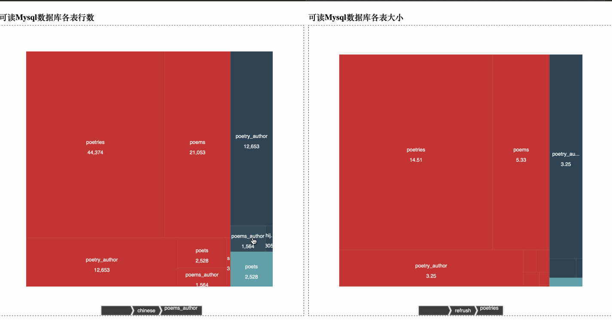

# 加推全栈开发之mysql数据库探针

## 项目背景

- 整合第三方商城后台数据

- 能快速查看数据库的表总数、分布、表大小等基本数据检测，以图形展示。

## 项目实操

  - 方式一

    1. 项目地址 [skybase](https://github.com/kongnet/skybase)
    2. clone后，安装全局nodemon,npm i -g nodemon.
    3. 运行demo9,npm run demo9，启动数据库探针
    4. 最终效果
        
  - 方式二（推荐方式）
    * 1. 使用skyjt安装skybase，项目地址： [skyjt](https://github.com/kongnet/sky)
    * 2. 安装 npm i -g skyjt
    * 3. 创建新的文件夹，cd 进入，执行
    * 4. jt init -f // 强制初始化

    

    * 5. cd进创建的目录，执行 **npm i** or **yarn** or **cnpm i**// 安装依赖包
    * 6. 安装全局nodemon, npm i -g nodemon.
    * 7. 执行 **nodemon** or **npm start** or **node index**
    * 8. 最终效果同方法一 // 数据库探针需要修改 **./config/config.default.js** 中 **mysql** 的配置
  - 注意

      请确认数据库链接正常，且有一定的数据.

      推荐使用方法二

## 项目运行流程

1. 流程图

    

2. 项目结构

    ``` js
    .
    ├── README.md
    ├── config                // 环境配置
    │   ├── config.default.js // 默认环境数据库配置
    │   ├── config.dev.js     // 开发环境数据库配置
    │   ├── config.prod.js    // 生产环境数据库配置
    │   ├── config.test.js    // 测试环境数据库配置
    │   └── index.js          // 环境判断
    ├── index.js              //项目执行文件
    ├── model                 //API定义 抽象类所处位置
    │   └── api
    │       └── skyapi
    │           └── probe.js
    ├── package.json            // 项目配置文件
    ├── router
    │   └── mysqlProbe.js       //路由 渲染数据库数据渲染到模版
    ├── service
    │   └── mysqlProbe.js       //服务 提供处理数据库实际方法
    ├── template
         └── treemap-mysql.html // 输出模板
    ```

3. 方法亮点详解

    - service/mysqlProbe.js

      ```js
      async function getTableColumnSize () {
        let sql = `select
        table_schema as 'dbName',
        table_name as 'tableName',
        table_rows as 'rowCount',
        truncate(data_length/1024/1024, 2) as 'dataSize',
        truncate(index_length/1024/1024, 2) as 'idxSize',
        table_comment as 'tableComment'
        from information_schema.tables
        order by data_length desc, index_length desc;` // 数据库查询语句
        let r = await db.cmd(sql).run() // 异步执行，返回所有数据表的数据
        let arr = []
        let arrSize = []
        let obj = {}
        r.forEach(item => {
          if (obj[item.dbName]) { // 如果存在节点就插入到children
            arr[obj[item.dbName]].children.push({ name: item.tableComment + '\n' + item.tableName + '\n\n' + ((item.rowCount + '').toMoney(2)), value: item.rowCount || 0 })
            arrSize[obj[item.dbName]].children.push({ name: item.tableComment + '\n' + item.tableName + '\n\n' + ((item.dataSize + '').toMoney(2)), value: item.dataSize || 0 })
          } else { // 如果不存在节点就创建
            if (!['performance_schema', 'mysql', 'information_schema', 'sys', 'happyminer_test'].includes(item.dbName)) { // 需要忽略的数据库
              // es7方法: includes
              // 如 [1, 2, 3].includes(2); // true
              // 在es7之前使用indexOf来判断数组中是否包含某个值。
              // 如果不确定是否支持，使用一下方法判断
              // const isInList = (() => {
              //  Array.prototype.includes
              //   ? (arr, value) => arr.includes(value)
              //   : (arr, value) => arr.some(el => el === value)
              //  )();
              //})
              arr.push({ name: item.dbName, children: [] })
              arrSize.push({ name: item.dbName, children: [] })
              obj[item.dbName] = arr.length - 1
            }
          }
        })
        arr.shift()// 因为增加了两条一样的初始数据，所以删除第一条。
        // console.log(arr)
        return {
          code: 0,
          data: { tableRow: arr, tableSize: arrSize }
        }
      }

      ```
